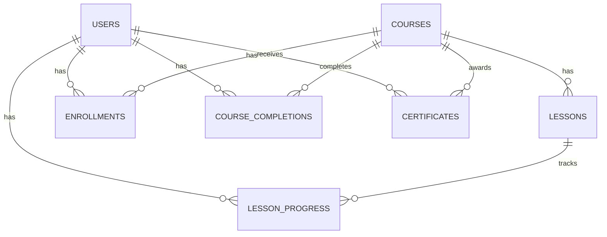

# ERD

## Core Relationships

- A course has many lessons.
- A user has many enrollments.
- An enrollment belongs to one user and one course.
- A user has many lesson progress records.
- A user has at most one course completion per course.
- A user has at most one certificate per course.

## Diagram

